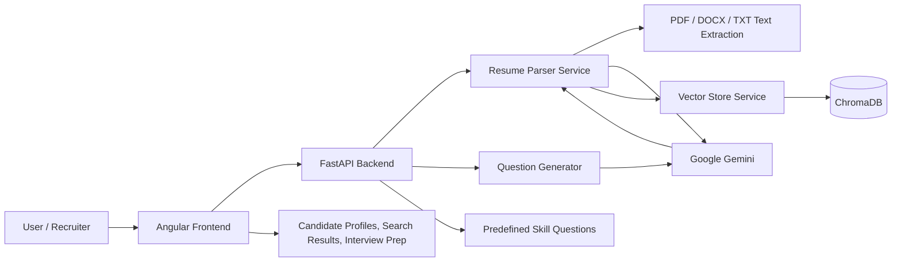
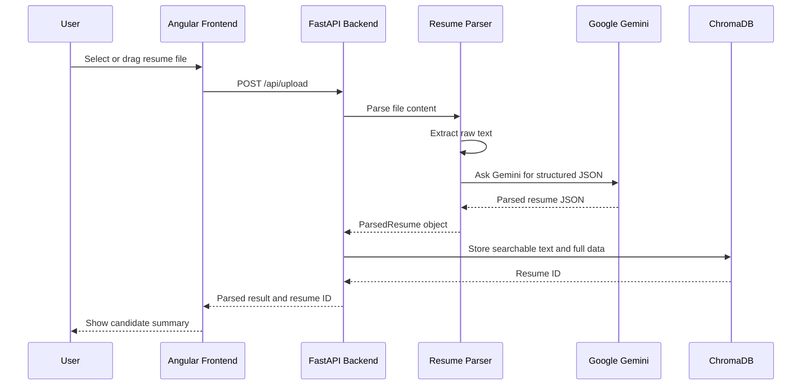
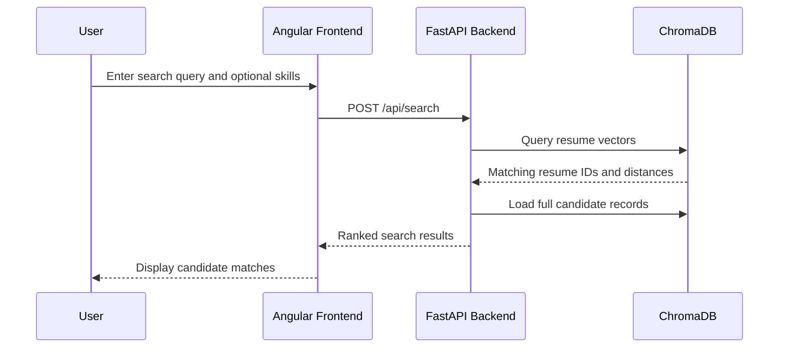

# Candidate Screening Assistant

Candidate Screening Assistant is an AI-powered resume screening system for recruiters, hiring teams, and interview preparation workflows. It accepts resume files, extracts structured candidate information with Google Gemini, stores searchable candidate records in ChromaDB, and helps users discover matching candidates or generate skill-based interview questions.

## What It Does

- Upload resumes in PDF, DOCX, DOC, or TXT format.
- Extract candidate details such as name, contact info, skills, education, experience, projects, certifications, languages, and total experience.
- Store parsed resumes in a persistent ChromaDB vector database.
- Search resumes semantically using natural language queries.
- Filter searches by skills and experience.
- View parsed candidate profiles in the frontend.
- Generate AI-based and predefined skill-based interview questions.

## Tech Stack

| Layer | Technology |
| --- | --- |
| Frontend | Angular 18, TypeScript, Bootstrap 5, Bootstrap Icons |
| Backend | Python, FastAPI, Uvicorn, Pydantic |
| AI | Google Gemini through LangChain Google GenAI |
| Vector Search | ChromaDB |
| Document Parsing | PyPDF2, python-docx |
| Deployment | Docker, Nginx for frontend |

## Project Structure

```text
.
+-- README.md
+-- docs/
|   +-- screenshots/
+-- candidate-screening-assistant-backend/
|   +-- app/
|   |   +-- main.py
|   |   +-- config.py
|   |   +-- data/
|   |   +-- models/
|   |   +-- services/
|   |       +-- question_generator.py
|   |       +-- resume_parser.py
|   |       +-- vector_store.py
|   +-- data/
|   +-- requirements.txt
|   +-- Dockerfile
+-- candidate-screening-assistant-frontend/
    +-- src/
    |   +-- app/
    |   |   +-- components/
    |   |   +-- services/
    |   +-- environments/
    |   +-- index.html
    +-- package.json
    +-- angular.json
    +-- nginx.conf
    +-- Dockerfile
```

## Architecture



## Main Workflow

1. The user opens the Angular frontend.
2. The user uploads a resume file.
3. The frontend sends the file to `POST /api/upload`.
4. FastAPI validates the file type.
5. The backend extracts text from PDF, DOCX, DOC, or TXT.
6. Gemini converts resume text into structured JSON.
7. Parsed data is saved in ChromaDB.
8. The frontend displays the candidate profile summary.
9. Users can search candidates through semantic queries.
10. Users can generate interview questions from candidate skills.

## Feature Flow

### Resume Upload



### Semantic Search



## Backend API

Base URL:

```text
http://127.0.0.1:8000
```

| Method | Endpoint | Purpose |
| --- | --- | --- |
| `GET` | `/` | API welcome message and endpoint list |
| `GET` | `/health` | Backend health status |
| `POST` | `/api/upload` | Upload and parse a resume |
| `POST` | `/api/search` | Semantic resume search |
| `GET` | `/api/resumes` | List parsed resumes |
| `GET` | `/api/resume/{resume_id}` | Get one parsed resume |
| `DELETE` | `/api/resume/{resume_id}` | Delete a resume |
| `GET` | `/api/resume/{resume_id}/questions` | Generate AI interview questions |
| `GET` | `/api/skill-questions` | Get predefined skill questions |
| `GET` | `/api/skill-questions/skills` | List available predefined skills |
| `GET` | `/api/resume/{resume_id}/skill-based-questions` | Match predefined questions to resume skills |

## Local Setup

### Prerequisites

- Node.js 20 or newer
- Python 3.11 or compatible Python version
- Google API key for Gemini

### Backend Setup

```powershell
cd "candidate-screening-assistant-backend"
python -m venv venv
.\venv\Scripts\activate
pip install -r requirements.txt
```

Create or update `.env`:

```env
GOOGLE_API_KEY=your_google_gemini_api_key
```

Run the backend:

```powershell
uvicorn app.main:app --host 127.0.0.1 --port 8000 --reload
```

Health check:

```powershell
Invoke-RestMethod http://127.0.0.1:8000/health
```

### Frontend Setup

```powershell
cd "candidate-screening-assistant-frontend"
npm install
npm start -- --host 127.0.0.1 --port 4200
```

Open:

```text
http://127.0.0.1:4200
```

On Windows, if PowerShell blocks `npm`, use:

```powershell
npm.cmd start -- --host 127.0.0.1 --port 4200
```

## Environment Configuration

Frontend API configuration is stored in:

```text
candidate-screening-assistant-frontend/src/environments/environment.ts
```

Default API URL:

```ts
apiUrl: 'http://127.0.0.1:8000/api'
```

Backend configuration is stored in:

```text
candidate-screening-assistant-backend/app/config.py
```

Important backend settings:

| Setting | Purpose |
| --- | --- |
| `GOOGLE_API_KEY` | Gemini API access |
| `CHROMA_DB_PATH` | Local ChromaDB persistence path |
| `MAX_FILE_SIZE` | Upload size limit |
| `ALLOWED_EXTENSIONS` | Supported resume file formats |
| `CORS_ORIGINS` | Frontend access control |

## Build

Build the frontend:

```powershell
cd "candidate-screening-assistant-frontend"
npm run build
```

The production build is generated at:

```text
candidate-screening-assistant-frontend/dist/candidate-screening-assistant
```

## Docker

Build backend image:

```powershell
cd "candidate-screening-assistant-backend"
docker build -t candidate-screening-assistant-api .
```

Build frontend image:

```powershell
cd "candidate-screening-assistant-frontend"
docker build -t candidate-screening-assistant-ui .
```

## Notes

- Resume parsing and AI question generation require a valid Google Gemini API key.
- ChromaDB data is stored locally under the backend data directory.
- The frontend can still load without existing resumes, but upload/search features need the backend running.
- The current Angular build may show bundle-size warnings; these are warnings, not build failures.
